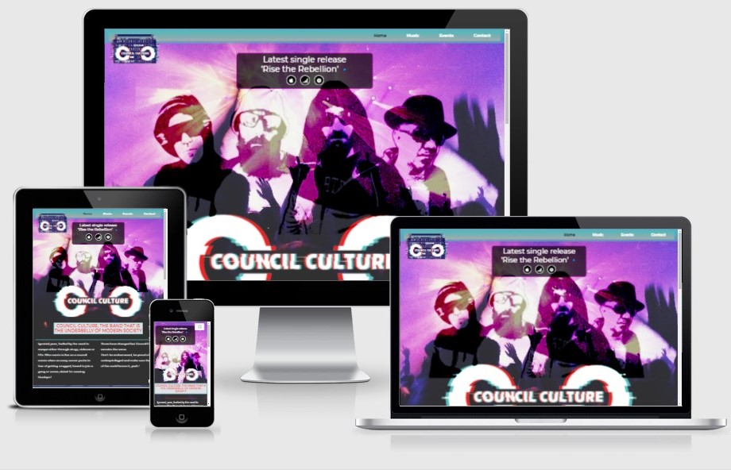
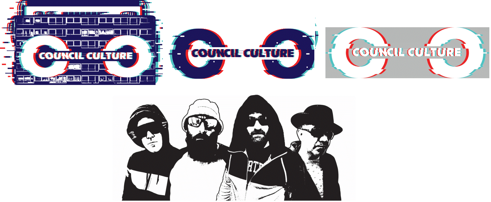
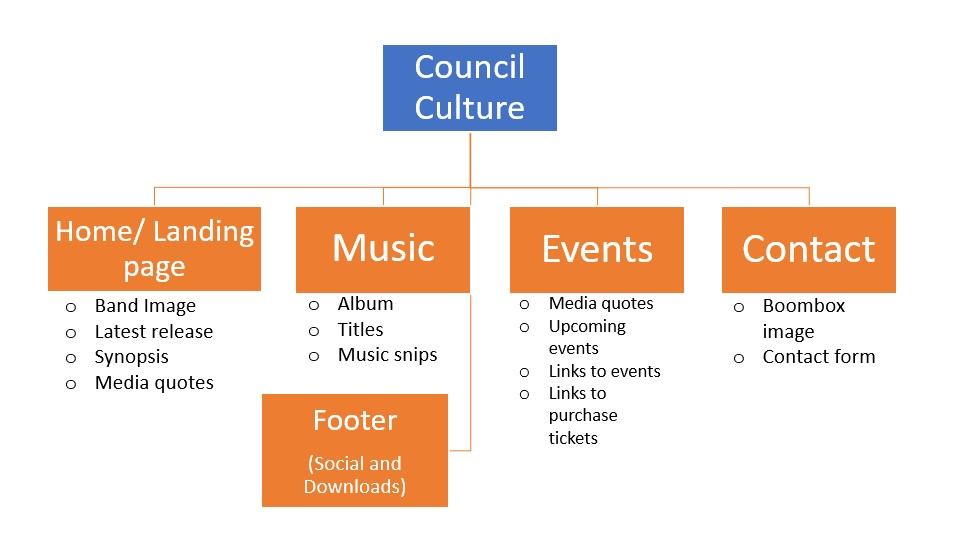
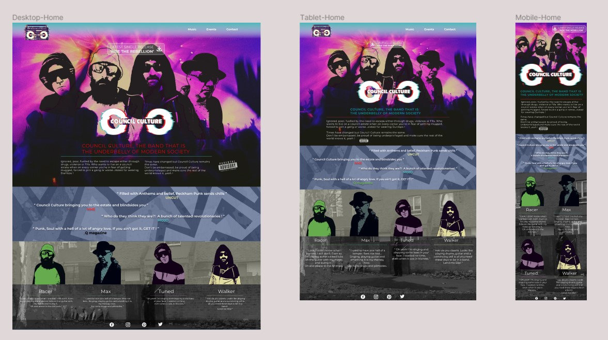
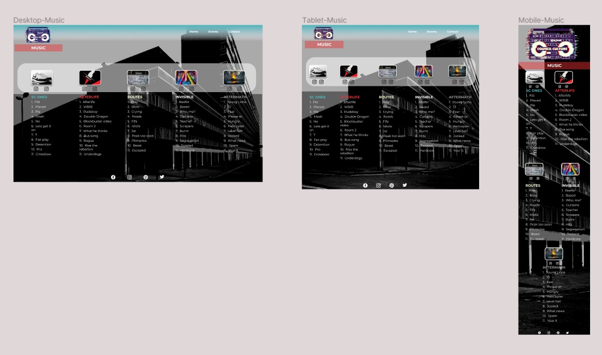
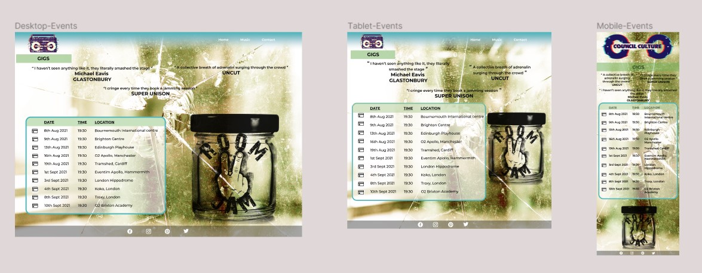
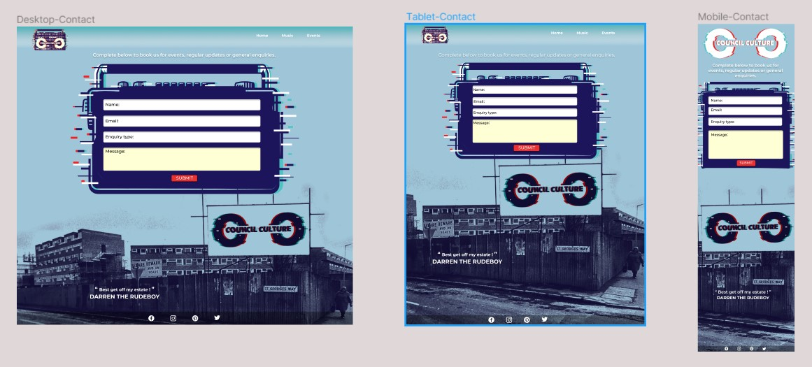
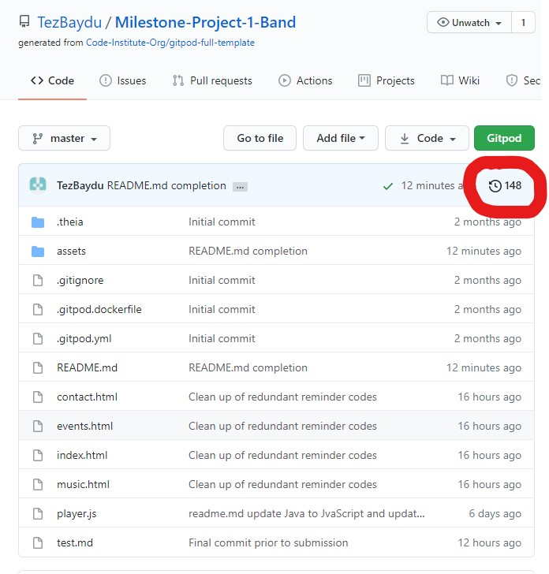

# Project Council Culture

[Council Culture website](https://tezbaydu.github.io/Milestone-Project-1-Band/)

## Contents
1. [Introduction](#Introduction)
2. [UX](#UX)
    - [Aims](#Aims)
    - [Demographic](#Demographic-both-current-and-potential)
    - [User Stories](#User-stories)
        - [Music Fan](#Music-fan)
        - [Events organiser](#Events-organiser)
        - [Journalist](#Journalist)
        - [Web developer](#Web-Developer)
    - [Development](#Development-Plan)
        - [Strategy](#Strategy)
            - [Demographic](#Demographic)
            - [Audience](#Understanding-the-audience)
            - [Requirements](#User-and-Band-members-requirements)
            - [Importance levels](#Levels-of-importance)
        - [Design and Scope](#Design-and-Scope)
            - [Influence](#Influence)
            - [Imagery](#Imagery)
            - [Pages](#Pages)
            - [Music](#Music)
            - [Structure](#Structure)
    - [Wireframe](#Wireframe)
3. [Features](#Features)
    - [Consistency](#Consistency)
    - [Home](#Home-page)
    - [Music](#Music-page)
    - [Events](#Events-page)
    - [Contact](#Contact-page)
4. [Technologies Used](#Technologies-Used)
5. [Bugs and Issues](#Bugs-and-Issues)
6. [Testing](#Testing) / [Testing detail file](https://github.com/TezBaydu/Milestone-Project-1-Band/blob/master/test.md)
    - [Commits](#Commits)
    - [Code testing](#Code-testing)
    - [Browser testing](#Browser-testing)
    - [Device testing](#Device-testing)
    - [Colour blindness Testing](#Colour-blindness-testing)
    - [User testing](#User-testing)
7. [Deployment](#Deployment)
    - [Gitpod commits](#Gitpod-to-GitHub-commits)
    - [GitHub Pages Deployment](#Deploying-via-GitHub-Pages)
    - [Forking](#Forking-repository)
    - [Cloning](#Cloning-a-repository)
8. [Credits and Acknowledgements](#Credits-and-Acknowledgements)

***

## Introduction

*Council Culture* is a new fictional band about a group of musicians who are friends that grew up in London during the 1980's and 1990's.
The idea came to me as I too had grown up in London and influenced by various types of music and culture.
This band's genre is mainly punk rock but has shades of funk, groove and reggae.
There is potential for this kind of music to break the market and give the under-privileged a perspective, especially once the pandemic is over there may well be some controversial political decisions that could affect the vulnerable.

This is the first project of a 4 module Full Stack Developer course provided by the [Code Institute](https://codeinstitute.net/).
Main requirements are to show understanding of HTML and CSS by developing a User Centric Front End website.

[Back to top ⇧](#Project-Council-Culture)

## UX

### Aims

1. To give users a visual experience of what the bands music is portraying.
    * 80's & 90's style punk rock with shades of colour to help represent funk, groove and reggae.

2. Easy navigation.

3. Responsive to all screens, sizes and browsers.

### Demographic both current and potential

* Nostalgic punk rock audience
* Music producers
* Event organisers
* Media companies

### User stories

#### Music fan
The user is either a current or potential fan and subscriber of many other groups.

*   This user wants to:
1. Be able to navigate through the website easily.
2. Learn about the band members and their influences.
3. Have an opportunity to listen to the bands music.
4. Be able to navigate to relevant social links.
5. Have the opportunity to download or listen to music via downloadable sites.
6. Be able to contact band and be part of newsletter/e-mail contact list.
7. Be able to find out where and when band is performing in future.

#### Events organiser
This user is an events organiser looking for a punk rock band to be part of a group of bands for an event.

*   This user wants to be able to:
1. View past and future events.
2. Listen to music.
3. Contact band with message to help detail requirements.
4. View links to social sites for further details.

#### Journalist
This user is working on a piece about new or current bands breaking the market.

* They want to be able to:
1. View bands history.
2. Understand what their music is portraying.
3. Listen to music.
4. Find which events band have and will perform.
5. Contact band for comment and rights issues.

#### Web Developer
This user is looking for imagery or influence for another project.

* They want to be able to:
1. Have easy navigation.
2. Find how the website was created.
3. Be able to see sources for design.
4. Be able to make contact with Developer.
5. Have an opportunity to clone site if wanting to use content.

[Back to top ⇧](#Project-Council-Culture)

### Development Plan
Development decisions came from influences from own skillset and experiences to help distinguish requirements to develop website.

[Back to top ⇧](#Project-Council-Culture)

#### Strategy
Identifying target audience.

##### Demographic
1. Nostalgic Punk Rock fans
    * 18-60 year olds
2. Rock events organisers
3. Journalists
    * Rock band publications
4. Web developers
    * 1st stage students with basic HTML, CSS and minimal Javascript knowledge
5. Friends 
    * Who now want to form a band...!!! (Watch this space)

##### Understanding the audience
1. Personality
    * Sense of humour
    * Looking for something different
2. Lifestyle
    * Politically aware
    * Modern
    * Music lovers
    * Interested in talented bands naturally formed

##### User and Band members requirements
1. User
    * View and understand Band
    * Listen to and download music
    * View upcoming events
    * Make contact directly or through social sites

2. Band members
    * Develop online presence
    * Provide format for latest releases and content
    * Announce upcoming events
    * Capture fan data for future communication
    * Provide opportunity for media enquiries

##### Levels of importance
Below are areas considered for levels of importance and viability

<u>Importance</u>
1. High
    * Online presence
    * Music promotion
    * Contact portal
    * Imagery
2. Medium
    * Music snips
    * Events promotion
3. Low
    * Sales

<u>Viability</u>
1. High
    * Online presence
    * Music promotion
    * Contact portal
    * Events promotion
2. Medium
    * Imagery
3. Low
    * Music snips
    * Sales

[Back to top ⇧](#Project-Council-Culture)

### Design and Scope

#### Influence
1. [Ghettoblaster on Pixabay](https://pixabay.com/photos/ghettoblaster-radio-recorder-boombox-1452077/)
2. Images and Band logo
    * Graphic Designer (Terry Downs)
    

#### Imagery
1. Colours
    *   Based on Band logos
2. Imagery
    * Associations to:
        * Council estates
        * Crime
        * Considered Poverty
3. Band members
    * Glasses and head covering for mystique
    * Band member names associated to latest Nike trainers

#### Pages
1. Home
2. Music
3. Events
4. Contact
*  Potential pages to develop
    1. Merchandise
    2. Videos
    3. Gallery

#### Music

1. Council Culture music
    * Created and produced for this site by newly formed band Council Culture.
2. Music snippets with playable buttons

#### Structure

Hierarchical structure design for simpler user navigation:

[Back to top ⇧](#Project-Council-Culture)

### Wireframe

- Designed in [Figma](https://www.figma.com/file/IADuVbH1W00VbiRkhlDqdY/milestone-project-1-band?node-id=0%3A1)

- Home Page

- Music Page

- Events Page

- Contact Page

[Back to top ⇧](#Project-Council-Culture)

## Features

This project has four separate pages found by clicking on the relevant name found in a menu.

### Consistency

- Design with menu placing in the same position.
    * A Band logo which leads the user back to 'Home' when clicked.
    * Mobile version to be a dropdown menu.
- Footer with links to social media and download options.
- Consistent colours (although variations may be used to suit): 
    * lightgoldenrodyellow 
        * #ffffd5 / #ffd / hsl(60,100,91) / rgb(255,255,213)
    * crimson
        * #ec3135 / #f33 / hsl(358,83,55) / rgb(236,49,53)
    * lightpink
        * #ffbfbf / #fcc / hsl(0,100,87) / rgb(255,191,191)
    * black
        * #000000 / #000 / hsl(0,0,0) / rgb(0,0,0)
    * darkslateblue
        * #4e618c / #569 / hsl(221,28,42) / rgb(78,97,140)
    * mediumturquoise
        * #4fb7bc / #5bc / hsl(182,44,52) / rgb(79,183,188)
- Consistent font:
    * montserrat
    * to use additional in case montserrat isn't available for users:
        * Ariel & sans serif

### Home page

1. Backdrops
    - Concert image
    - Grafitti image
    - Crime scene image is intentionally subtle
2. Band members
    - Shown as a group
    - Shown separately
3. Synopsis
    - Group description
    - Individual band member Quotes
4. Reviews
    - Music publishers
5. Bulletin
    - Latest single release
6. Music
    - Snippet of latest release
7. Social sites and Downloads
    - Buttons which change colour when hovered over
    - Button source Font-Awesome
8. Navigation
    - Taken from Bootstrap
        - Menu bar showing different colour for active page.
        - Band logo image linking to Home page.
        - Adjustable to button dropdown for mobile.
9. Design
    - HTML
        - Adjustment to HTML script for different widths to accomodate responsive design.
        - Max: Widths
            - 1199px
            - 991px
            - 767px
        - Min: Widths
            - 992px
                - Navbar
            - 768px
                - Navbar
            - 576px
                - Home: Header-text-mobile adjustment

### Music page

1. Music
    - Album images
    - Associated tracks to title
    - Music snippets
2. Backdrop
    - Full image of a council estate
    - Fixed background position
3. Social sites and Downloads
    - Buttons which change colour when hovered over
    - Button source Font-Awesome
4. Navigation
    - Taken from Bootstrap
        - Menu bar showing different colour for active page.
        - Band logo image linking to Home page.
        - Adjustable to button dropdown for mobile.
5. Design
    - HTML
        - Adjustment to HTML script for different widths to accomodate responsive design.
        - Max: Widths
            - 1199px
            - 991px
            - 767px
        - Min: Widths
            - 1199px
                - Music: Album image container
            - 992px
                - Navbar
            - 768px
                - Navbar
                - Music: Album image adjustment
            - 576px
                - Music: Banner adjustment

### Events page

1. Reviews
    - Past event reviews
2. Calendar
    - Table of upcoming events
3. URL links
    - Links to event sites for more information
4. Backdrop
    - Glass with bullethole
    - Fixed position
5. Room 2 Jam jar
    - Cheeky image associated to where band rehearse.
6. Social sites and Downloads
    - Buttons which change colour when hovered over
    - Button source Font-Awesome
7. Navigation
    - Taken from Bootstrap
        - Menu bar showing different colour for active page.
        - Band logo image linking to Home page.
        - Adjustable to button dropdown for mobile.
8. Design
    - HTML
        - Adjustment to HTML script for different widths to accomodate responsive design.
9. Design
    - HTML
        - Adjustment to HTML script for different widths to accomodate responsive design.
        - Max: Widths
            - 1199px
            - 991px
            - 767px
        - Min: Widths
            - 992px
                - Navbar
            - 768px
                - Navbar
            - 576px
                - Events: Banner adjustment

### Contact page

1. Statement
    - Clear statement of contact
2. Form
    - Bootstrap associated form
        - First name
        - Last name
        - Email
        - Enquiry type
        - Message
        - Submit button
3. Backdrop
    - Image of a council estate
4. Images
    - Council cultur Boombox as backdrop to form.
5. Social sites and Downloads
    - Buttons which change colour when hovered over
    - Button source Font-Awesome
6. Navigation
    - Taken from Bootstrap
        - Menu bar showing different colour for active page.
        - Band logo image linking to Home page.
        - Adjustable to button dropdown for mobile.
7. Design
    - HTML
        - Adjustment to HTML script for different widths to accomodate responsive design.
        - Max: Widths
            - 1199px
            - 991px
            - 767px
        - Min: Widths
            - 992px
                - Navbar
            - 768px
                - Navbar

[Back to top ⇧](#Project-Council-Culture)

## Technologies Used

- HTML5
    * Code used to provide content to the website

- CSS3
    * Code used to style content

- Javascript
    * Code used for media play buttons

- [Coolors - colour collage](https://coolors.co)

- [Pixabay - images](https://pixabay.com)

- [Decades.com - advisory notice](https://www.decades.com)

- [Github](https://github.com)

- [Gitpod](https://www.gitpod.io)

- [Bootstrap](https://getbootstrap.com)
    * Version 4.5 (Latest version at the time of this projects creation)

-[Google fonts](https://fonts.google.com)

- [Figma](https://www.figma.com)
    * [project wireframe](https://www.figma.com/proto/IADuVbH1W00VbiRkhlDqdY/milestone-project-1-band?node-id=5%3A71&scaling=min-zoom)

- [Font Awesome](https://fontawesome.com/v4.7.0)
    * version 4.7

- [Bootstrapcdn](https://www.bootstrapcdn.com)

- [Audio Trimmer](https://audiotrimmer.com)

- [Responsive design checker](https://responsivedesignchecker.com)

- [Am I responsive](http://ami.responsivedesign.is)

- [HTML code checker](https://validator.w3.org)

- [CSS code checker](https://jigsaw.w3.org/css-validator)

- [Extends Class JavaScript validator](https://extendsclass.com/javascript-fiddle.html)

- [Browser test site - Browser|Shots](http://browsershots.org)
    - Became inaffective 12/04/2021

- [Browser site testing - BrowserStack](http://browserstack.com)

- [RGBlind chrome extension]

- [Eye Dropper extension]

[Back to top ⇧](#Project-Council-Culture)

## Bugs and Issues

- Bootstrap
    - Below Bootstrap link obtained from Bootstrapcdn but looks like an older version at 4.5.2 and so has been excluded
    "https://stackpath.bootstrapcdn.com/bootstrap/4.5.2/css/bootstrap.min.css"

- Media play buttons
    * Found a way of having a play button using HTML only. However this caused issues as was unable to toggle between play and pause and when there were several instances in one page music would overplay each other or would play and pause one song at a time.
        * After much searching I found a solution using JavaScript through the Github user "Ilker Yilmaz" "https://github.com/kuantal/Multiple-circular-player" and was able to use the scripts as shown on their gitpod to make a successful play pause action for songs. Sizes and style adjusted to suit site.

- CSS code checker
    - Bootstrap
        - Errors associated to Bootstrap
            - Property overflow-anchor doesn't exist : none
            - Property text-decoration-skip-ink doesn't exist : none
        - Does not affect website efficiency but to be considered if having issues with these particular property elements

- Fixed images in body element
    - Fixed backdrop images in Body replaced after removing from separate div.
        - This had played havoc with images in foreground (events.html Room-2 jam jar) where wasn't mixing in blend mode for mobile and ipad devices.
        - Decided to apply to separate Div to Contacts page for court-estate image and Events page for the glass-hole image and fill spaces to push images down to fill space.

[Back to top ⇧](#Project-Council-Culture)

## Testing 
-   ### View [Test.md file](https://github.com/TezBaydu/Milestone-Project-1-Band/blob/master/test.md) for more detail

### Commits
- Over 140 commits

### Code Testing
- HTML 
- CSS
- Java
   
### Browser testing

- Browsershots.org
- Chrome
- Firefox
- Microsoft Edge
- Safari

### Device testing

- [Responsive design checker](https://responsivedesignchecker.com)
- [Am I responsive](http://ami.responsivedesign.is)

### Colour blindness testing

- RGBlind Chrome extensions

### User Testing

- Friends & Family testing

[Back to top ⇧](#Project-Council-Culture)

## Deployment

### Gitpod to GitHub commits

To help with controlling versions you can commit to GitHub via Gitpod.
Once you are able to view the repository in Gitpod this is done by:

1. Access the control terminal
    - Usually found at bottom of project in "workspace" section.
2. Next to gitpod/workspace/(name of project)
    - Type "git add (and name of document you wish to commit to GitHub)".
    - If you want to find all that could be committed then you can type "git add ."
3. Type "git status"
    - This will help show what files have been modified, added or deleted for a pre-check prior to committing.
4. Type "git commit -m ("and then a brief description of latest updates in quotation marks")"
5. Type "git push"
6. Log into GitHub
    - Locate repository
    - You should be able to see the latest and history of commits in code section at top right of table of files list.
    

### Deploying via GitHub Pages

1. Log into GitHub and look for [https://github.com/TezBaydu/Milestone-Project-1-Band] or create an account.
2. Click on settings and ensure repository name is selected to Milestone-Project-1-Band.
3. Scroll down to GitHub Pages section and ensure Branch is 'Master' and folder is 'root'.
4. Click save and wait for site to be published.
5. Click link in GitHub Pages section to view published site.

### Forking repository

Forking a repository in GitHub is used to make a copy of a repository which you do not have rights access to. Once you have forked a repository you will be able to make changes without affecting the original. It can also be used to suggest changes of an original project and/or propose a project as starting point.

Steps on Forking a repository:
1. Log into GitHub and look for [https://github.com/TezBaydu/Milestone-Project-1-Band] or create an account.
2. At the top right hand corner of the page select "Fork".
3. You should now have a copy of the original repository to work with on your account without affecting the original.

### Cloning a repository

Cloning a repository in GitHub allows you to make a copy of your own repository which will affect the original repository.
If you wish to make changes which do not affect the original then this should be forked.

Steps to Clone a repository
1. Log into GitHub and look for [https://github.com/TezBaydu/Milestone-Project-1-Band] or create an account.
2. Ensure "Code" has been selected in menu.
3. Select code on top right of table.
4. Select either HTTPS, SSH or CLI.
5. You can either download ZIP for static files and utilise in GitHub or open with GitHub desktop.
6. If opening with GitHub Desktop then select. If not downloaded this will need to be to utilise benefits.
7. Once opened with GitHub Desktop select "File".
8. Select "Clone repository".
9. Select GitHub and the name of the GitHub repository. (URL can also be selected and the URL applied)
10. Select repository from the sources.
11. Click "Choose".
12. Click "Clone".

For further help and info you can select [Cloning and Forking repositories](https://docs.github.com/en/desktop/contributing-and-collaborating-using-github-desktop/cloning-and-forking-repositories-from-github-desktop)

[Back to top ⇧](#Project-Council-Culture)

## Credits and Acknowledgements

- Council Culture
    * Music by band Council Culture.
        * Music created as a result of project.
        * Watch this space!

- Terry Downs
    * Band images and logos

- kuantal/Multiple-circular-player
    * Play button for multiple tracks to play and pause

- rebeccatraceyt/KryanLive in GitHub
    * For providing guidance on good practice

- Sites
    * [Stack Overflow](https://stackoverflow.com)
    * [Git Hub](https://github.com)
    * [Bootstrap](https://getbootstrap.com)

- Seun Owinokoko
    * For her positive, excitable response to the design and advice

- Friends and family
    * For patience and encouragement during course and user testing

[Back to top ⇧](#Project-Council-Culture)

