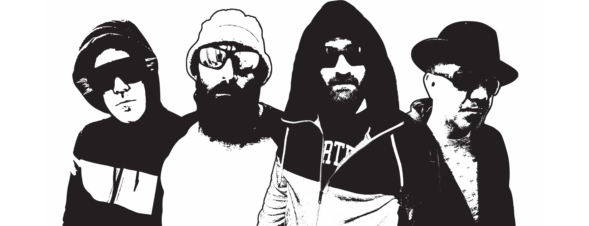

# Project Council Culture

[Council Culture](https://tezbaydu.github.io/Milestone-Project-1-Band/)

## Contents
1. [Introduction](#Introduction)
2. [UX](#UX)
    1. [Aims](#Aims)
    2. [User Stories](#User-stories)
    3. [Design](#Design)
    4. [Wireframe](#Wireframe)
3. [Features](#Features)
    1. [Consistency](#Consistency)
    2. [Home](#Home)
    3. [Music](#Music)
    4. [Events](#Events)
    5. [Contact](#Contact)
4. [Technologies Used](#Technologies-Used)
5. [Mentor questions](#Mentor-Questions)
    1. [Meeting 2](#Mentor-Meeting-2)
6. [Bugs and Issues](#Bugs)
7. [Testing](#Testing)
     1. [Code testing](#Code-testing)
     2. [Browser testing](#Browser-testing)
     3. [Colour blindness Testing](#Colour-blindness-testing)
     2. [User testing](#User-testing)
8. [Deployment](#Deployment)
9. [Credits](#Credits)

***

## Introduction

*Council Culture* is a new fictional band about a group of musicians who are friends that grew up in London during the 1980's and 1990's.
The idea came to me as I too had grown up in London and influenced by various types of music and culture.
This band's genre is mainly punk rock but has shades of funk, groove and reggae.
There is potential for this kind of music to break the market and give the under-privileged a perspective, especially once the pandemic is over there may well be some controversial political decisions that could affect the vulnerable.

[Back to top ⇧](#Project-Council-Culture)

### UX

#### Aims

- Aimed at nostalgic punk rock audience, music producers and event organisers looking to hire bands.

- To give users a visual experience of what the bands music is portraying.
    * 80's & 90's style punk rock with shades of colour to help represent funk, groove and reggae.

- Easy navigation to musical tracks, events and contact page

- To be fully responsive to all screens and sizes

#### User stories

1.  This user is an events organiser looking for a punk rock band to be part of a group of bands for an event. They look for other events the band have performed and reviews they have had.

2. This user is in their early 50's who is a fan of punk rock looking for other music to listen to. The user is a fan and subscriber of many other groups and may want to know more of this bands progress in the future.

3. This user is a journalist working on a piece about new bands breaking the market. They are completely independent and will also look to give honest opinion of their music based on their own experiences of the band genre.

4. This user has no interest in punk rock music at all but is looking for imagery or influence for another project.

#### Design

1.  The design was initally inspired by an image found on Pixabay of a ghettoblaster and once discussed with Graphic Designer (Terry Downs) who sent over images and logo ideas, it breathed the initial elements of the project. Based on some user stories I've decided to focus on the following pages: Home, Music, Events, Contact.
2. Pages not developed but potential to add: Merchandise, Videos, Gallery
3. Colour focus is mainly based on the band logo.
4. Imagery has associations to council estates, crime and considered poverty.
5. Band members have been given names associated to brands of Nike, this being the preferred trainer footwear at the time.
6. Band members have been given hats, glasses and certain colour shades to allow for mystique.
7. Home page is to draw the user and other pages to be more focussed on user requirements.
8. Pages to have a snippet of music for users to listen to and if wanting to download, these buttons are available also.

[Back to top ⇧](#Project-Council-Culture)

#### Wireframe

- Designed in [Figma](https://www.figma.com/file/IADuVbH1W00VbiRkhlDqdY/milestone-project-1-band?node-id=0%3A1)

- Home Page

- Music Page

- Events Page

- Contact Page

[Back to top ⇧](#Project-Council-Culture)

### Features

This project has four separate pages found by clicking on the relevant name found in a menu

#### Consistency

- Design with menu placing in the same position.
    * A Band logo which leads the user back to 'Home' when clicked.
    * Mobile version to be a dropdown menu
- Footer with links to social media, download/purchase options.
- Consistent colours: 
    * lightgoldenrodyellow 
        * #ffffd5 / #ffd / hsl(60,100,91) / rgb(255,255,213)
    * crimson
        * #ec3135 / #f33 / hsl(358,83,55) / rgb(236,49,53)
    * lightpink
        * #ffbfbf / #fcc / hsl(0,100,87) / rgb(255,191,191)
    * black
        * #000000 / #000 / hsl(0,0,0) / rgb(0,0,0)
    * darkslateblue
        * #4e618c / #569 / hsl(221,28,42) / rgb(78,97,140)
    * mediumturquoise
        * #4fb7bc / #5bc / hsl(182,44,52) / rgb(79,183,188)
- Consistent font:
    * montserrat
    * to use additional in case montserrat isn't available for users:
        * Ariel & sans serif

#### Home

- Concert image and other images of band members
- Statement of the bands music, influence and history
- Individual synopsis of band members
- Music Reviews
- Latest single bulletin with a snippet of playable track

#### Music

- List of albums and tracks
- Images of album covers
- Downloadable music content
- Snippets of some playable tracks to lure user

#### Events

- Reviews of past band performances.
- Calendar of Events
    * Ticket purchase button for each. Leads to livenation site.
    * Places clicked links to venue and map location.
- Quotes from fans and followers.

#### Contact

- Form to be filled in for 
    * event enquiries to book band to perform
    * to receive regular newsletters
    * General enquiries - potentially from music/media journalists

[Back to top ⇧](#Project-Council-Culture)

### Technologies Used

- HTML5
    * Code used to provide content to the website

- CSS3
    * Code used to style content

- [Coolors - colour collage](https://coolors.co/)

- [Pixabay - images](https://pixabay.com)

- [Decades.com - advisory notice](https://www.decades.com/)

- [Github](https://github.com/)

- [Gitpod](https://www.gitpod.io/)

- [Bootstrap](https://getbootstrap.com/)
    * Version 4.5 (Latest version at the time of this projects creation)

- [Figma](https://www.figma.com)
    * [project wireframe](https://www.figma.com/proto/IADuVbH1W00VbiRkhlDqdY/milestone-project-1-band?node-id=5%3A71&scaling=min-zoom)

- [Font Awesome](https://fontawesome.com/v4.7.0/)
    * version 4.7

- [Bootstrapcdn](https://www.bootstrapcdn.com/)

- [Audio Trimmer](https://audiotrimmer.com/)

- [Responsive design checker](https://responsivedesignchecker.com/)

- [Am I responsive](http://ami.responsivedesign.is/)

- [HTML code checker](https://validator.w3.org/)

- [CSS code checker](https://jigsaw.w3.org/css-validator/)

- [Extends Class JavaScript validator](https://extendsclass.com/javascript-fiddle.html)

- [Browser test site - Browser|Shots](http://browsershots.org/)

- [RGBlind chrome extension]

[Back to top ⇧](#Project-Council-Culture)

### Mentor Questions

 #### Mentor Meeting 2

- CSS device size adjustments
    * seemed like there was quite a lot at first with the Home Page
    * Can we review to see if is suitable? 
        - Ok as shows understanding of CSS
            - done

- Commits to be mentioned as part of test
    - done

- Use image from am i responsive design checker in readme

- Change Java to JavaScript in credit notes
    - done

- Add comment in player.js of source and link
    - done

- list-inline-item in header download formats only when url refreshes
    - updated by changing display from inline-block to contents for @media (max-width: 767px) 
        - done

- Nav header text to make bolder
    - done

- Row below Grafitti image to wrap around text quotes. i.e. parent of
    - Wasn't the actual issue. created a bar as was display row of 'header-text-mobile' in devices larger than 767px.
        * Adjusted so this div has Display as none in sizes larger than mobile.
            - done

- Grafitti quotes padding top and bottom (15px)
    - done via container
        - also done for mobile adjustments
            -done

- Band quotes padding
    - done via container
        - also done for mobile adjustments
            - done

- CC Logo white
    - adjusted padding so shows spaced too
        -done

- Footer
    - Padding top and bottom added by 1%
    - Margin bottom negative so sticks to bottom
        - done

- IPAD
    - Nav bar, not Nav button
        -done

    - Home
        - Band mambers 4 split as looks squashed
         - done
         
    - Music
        - To look like mobile splits
            - Decided this would look too slim so have applied a different look for ipad device
            - done

- Music
    - Padding on text top and bottom
        - done

    - Potential text spacing
        - done

    - issue with 991px responsive design
        - done

    - Mobile device version text and button alignment adjustments
        - done

- Events
    - Space above jar doesn't look right - responsivedesignchecker
        - done

    - Mobile view looks perfect
    - Ipad Pro design events table can widen
        - done

    - Padding in quotes updated for better spacing
        - done

- Contact
    - Form on mobile to have fields Align
        - Also adjusted form design for % responsiveness
            - done 

    - Ipad Pro - statement bring down as too close to CC logo
        - Adjustment on all versions to be more responsive
            - done

    - Potential note change prior to submission
        - note changed

- Test doc to be placed in new md file and to be detailed
    

### Bugs

- Media play buttons
    * Found a way of having a play button using HTML only, however this caused issues as was unable to toggle between play and pause and when there were several instances in one page music would overplay each other or would play and pause one song at a time, regardless of which button it was associated to.
        * After much searching I found a solution using JavaScript through the Github user "Ilker Yilmaz" "https://github.com/kuantal/Multiple-circular-player" and was able to use the scripts as shown on their gitpod to make a successful play pause action for songs. sizes and style adjusted to suit site.

- Index.html
    * list-inline header-download
        * needs page to reload for it to sit horizontally....? Even on responsive design checker - associated to list-inline-item style.css line 532: to work on.
            - done

- css code checker
    * Sorry! We found the following errors (2)
    * URI : https://cdn.jsdelivr.net/npm/bootstrap@4.5.3/dist/css/bootstrap.min.css
        * 6	abbr[data-original-title], abbr[title]	Property text-decoration-skip-ink doesn't exist : none
        * 6	.accordion	Property overflow-anchor doesn't exist : none
    - This is the code asked to be copied from bootstrap but is showing errors on a couple of styles not encoded
        - Is a Bootstrap issue therefore no problem as long as it doesn't have an affect on the site.

    * Warnings
        * these extensions are recognised in chrome but not in validator
            * This issue is with bootstrap and is ok to be noted as does not affect website proficiency.
    
    * svg code for colourblindness not displayed as causes a row under footer.
        * by activating CSS display: none the row is removed visually, even though this did not impact on devices directly it was done this way to ensure assessments were not mis-directed.
            - Problem as this also removes the play button - Question for Mentor as adjustment isn't associated to CSS or HTML and directly affecting Browser as is part of colour blindness extension?
                - Solution: RGBlind Extension was automatically applying to css. Updated extension so it only activates when RGBlind button is pressed in browser.

[Back to top ⇧](#Project-Council-Culture)

### Testing
#### Code Testing

- HTML 

- CSS

- Java
    * Checked Javascript code against [Extends Class JavaScript validator](https://extendsclass.com/javascript-fiddle.html)
        * Updated to add semicolons where expected

#### Browser testing

- Tested on Browsershots.org
    *HTTP_USER_AGENT 'Mozilla/5.0 (Windows NT 10.0; Win64; x64) AppleWebKit/537.36 (KHTML, like Gecko) Chrome/89.0.4389.90 Safari/537.36'
    * One error: What does it mean....?
        * Exception Type:	AttributeError
        Exception Value:	'SafeText' object has no attribute 'status_code'
        Exception Location:	/usr/local/lib/python2.7/dist-packages/django/middleware/locale.py in process_response, line 41
        Python Executable:	/usr/bin/python
        Python Version:	2.7.17

        * Looked online in stack overflow and has been answered but involves Django:
            *https://stackoverflow.com/questions/43987462/django-safetext-object-has-no-attribute-get

#### Colour blindness testing

- Adjusted Home page h1 to have a contrasting background to work with Protanopia

#### User Testing

- Align mobile contact image

- Make buttons slightly bigger for mobile, however still work when small (similar size as letters when typing)
    * Adjusted larger as design has carried on.

[Back to top ⇧](#Project-Council-Culture)

### Deployment

- GitHub Pages
    - Log into GitHub and look for [https://github.com/TezBaydu/Milestone-Project-1-Band]
    - click on settings and ensure repository name is selected to Milestone-Project-1-Band
    - scroll down to GitHub Pages section and ensure Branch is 'Master' and folder is 'root'
    - click save and wait for site to be published.
    - click link above GitHub Pages section to view published site.

[Back to top ⇧](#Project-Council-Culture)

### Credits

- Council Culture
    * Music by band Council Culture
        * Watch this space!

- Terry Downs
    * Band images and logos

- kuantal/Multiple-circular-player
    * Play button for multiple tracks to play and pause

- Seun Owinokoko
    * For her positive, excitable response to the design and advice

- Friends and family
    * For plenty of user testing

